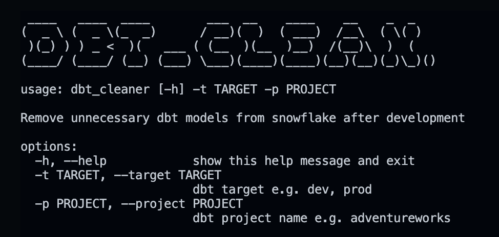

# DBT Clean 


# Instructions
To remove unwanted materialised models from your snowflake account:

1. Copy and paste the `dbt_cleaner.py` script into your dbt project. You can find the script [here](./transform/adventureworks/dbt_cleaner.py)

1. Run the following command to find materialised models that can be deleted. Use `python dbt_cleaner.py -h` command for cleaner's documentation.
    ```python
    python dbt_cleaner.py --target prod --project adventureworks
    ```

# Demo
